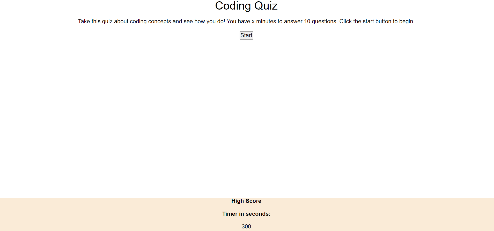

# Code Quiz

## Description

Quiz yourself with some basic questions about JavaScript and some of its many functions. Try to obtain the high score by finishing the quiz in the shortest amount of time!

## Usage

Click on the start button to reveal the first question then select on of the answers to progress to the next question. The test is over once all five questions are answered or time runs out.

